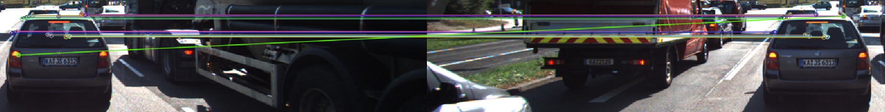
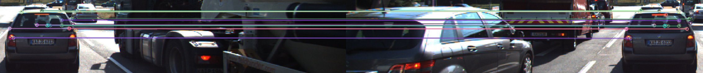
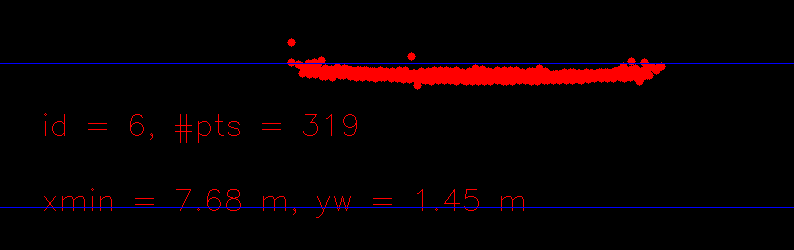
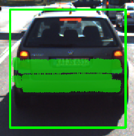

# 3D Object Tracking | Estimating Time to Collision using Camera and LiDAR

Keywords: keypoint detectors, descriptors, and methods to match them between successive images, objects detection in an image using the YOLO deep-learning framework, associating regions in a camera image with Lidar points in 3D space.

Matching 3D objects over time by using keypoint correspondences. 
Compute the TTC based on LiDAR measurements. 
Compute the TTC based on camera images, which requires to first associate keypoint matches to regions of interest and then to compute the TTC based on those matches. 
Conducting various tests with the framework, so as to identify the most suitable detector/descriptor combination for TTC estimation and also to search for problems that can lead to faulty measurements by the camera or LiDAR sensor. 
Later on, we will use the Kalman filter to combine the two independent TTC measurements for increased reliability.

## Dependencies for running locally
* cmake >= 2.8
  * All OSes: [click here for installation instructions](https://cmake.org/install/)
* make >= 4.1 (Linux, Mac), 3.81 (Windows)
  * Linux: make is installed by default on most Linux distros
  * Mac: [install Xcode command line tools to get make](https://developer.apple.com/xcode/features/)
  * Windows: [Click here for installation instructions](http://gnuwin32.sourceforge.net/packages/make.htm)
* OpenCV >= 4.1
  * This must be compiled from source using the `-D OPENCV_ENABLE_NONFREE=ON` cmake flag for testing the SIFT and SURF detectors.
  * The OpenCV 4.1.0 source code can be found [here](https://github.com/opencv/opencv/tree/4.1.0)
* gcc/g++ >= 5.4
  * Linux: gcc / g++ is installed by default on most Linux distros
  * Mac: same deal as make - [install Xcode command line tools](https://developer.apple.com/xcode/features/)
  * Windows: recommend using [MinGW](http://www.mingw.org/)

## Build instructions

1. Clone this repo.
2. Make a build directory in the top level project directory: `mkdir build && cd build`
3. Compile: `cmake .. && make`
4. Run it: `./3D_object_tracking`

## Steps

### Matching 3D objects
matchBoundingBoxes() in src/sensorFusion.cpp takes as input both the previous and the current data frames and provides as output the ids of the matched regions of interest (i.e. the boxID property). Matches must be the ones with the highest number of keypoint correspondences. Each bounding box is assigned the match candidate with the highest number of occurrences.

Using a std::multimap<int, int> to track pairs of bounding box IDs. The keypoint correspondences per box pair are counted in order to determine the best matches between frames. Counting the greatest number of matches in the multimap, where each element is {key=currBoxID, val=prevBoxID}

### Computing LiDAR-based TTC
The time-to-collision (TTC) in seconds is computed in sensorFusion.cpp for all matched 3D objects using only LiDAR measurements from the matched bounding boxes between current and previous frame. Outlier LiDAR points are dealt with in a statistically robust way to avoid severe estimation errors.

The median distance in x was taken on each frame to reduce the impact of outlier LiDAR points on TTC estimate.

### Associating keypoint correspondences with bounding boxes
The TTC is computed in sensorFusion.cpp based on camera measurements by associating keypoint correspondences to the bounding boxes which enclose them. All matches which satisfy this condition are added to a vector in the respective bounding box. The keypoint correspondences are added to the "kptMatches" property of the respective bounding boxes. Also, outlier matches have been removed based on the euclidean distance between them in relation to all the matches in the bounding box.

For each bounding box, the code loops through every matched keypoint pair in an image. If the keypoint falls within the bounding box region-of-interest (ROI) in the current frame, the keypoint match is associated with the current BoundingBox data structure.

### Computing mono camera-based TTC
The time-to-collision in second is computed for all matched 3D objects using only keypoint correspondences from the matched bounding boxes between current and previous frame. Outlier correspondences are dealt with in a statistically robust way to avoid severe estimation errors.

Using distance ratios on keypoints matched between frames to determine the rate of scale change within an image. This rate of scale change can be used to estimate the TTC.

Using the median distance ratio to avoid the impact of outliers. There are still some very inaccurate estimations such as NaN, -inf, etc if there are too many mismatched keypoints. Also, the Big O notation for this algorithms is O(n^2) (dependent on the number of keypoints), since it calculates the Euclidean distance for every paired combination of keypoints within the bounding box.

### LiDAR performance evaluation
Examples where the TTC estimate of the LiDAR sensor does not seem plausible, possible due to. The assertion that the TTC is off has been based on manually estimating the distance to the rear of the preceding vehicle from a top view perspective of the Lidar points.

Using the median point instead of the closest point helps prevent large miscalculations. If we use the closest point even rain could potentially bias the TTC estimation.

### Camera performance evaluation and detector/descriptor combinations
Several detector / descriptor combinations were run and their respective TTC estimations were compared. The methods which perform best are: ..
All detector / descriptor combinations implemented in previous projects have been compared with regard to the TTC estimate on a frame-by-frame basis:

Harris and ORB produced quite unreliable TTC estimates. SIFT, FAST and AKAZE's were closer to those calculated using LiDAR measurements only.

The best detector-descriptor combinations for this implementation (absolute 0.01s difference between LiDAR and Camera TTC estimation) seem to be:
FAST + FREAK (with LiDAR TTC being slightly higher than Camera TTC, eg. 12.61s vs 12.6s respectively)
SHITOMASI + ORB (with LiDAR TTC being slightly higher than Camera TTC, eg. 11.98s vs 11.97s respectively)
ORB + BRISK (with LiDAR TTC being slightly higher than Camera TTC, eg. 9.6s vs 9.59s respectively)

Close second places (absolute 0.02s difference between LiDAR and Camera TTC estimation) are:
ORB + SIFT (with LiDAR TTC being slightly higher than Camera TTC, eg. 9.52s vs 9.5s respectively)
SIFT + FREAK (with LiDAR TTC being slightly higher than Camera TTC, eg. 9.52s vs 9.5s respectively)
SIFT + BRISK (with Camera TTC being slightly higher than LiDAR TTC, eg. 9.99s vs 9.96s respectively)
SIFT + BRIEF (with Camera TTC being slightly higher than LiDAR TTC, eg. 13.04s vs 13.02s respectively)

Note: we're minimising the difference between LiDAR and Camera Time-to-Collision (TTC) calculations, however arguably there would be better metrics to measure performance, since they could both be wrong after all.
